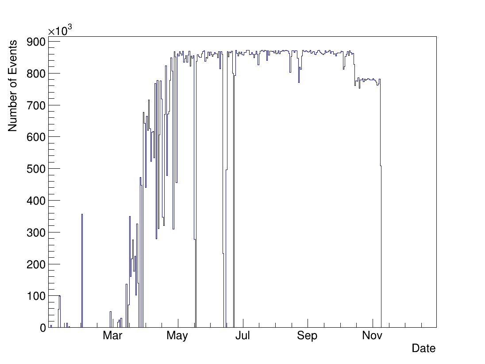

This plot is a histogram of the number of events recorded by the PA as a function of time for 2019

Needs py3 and pyroot, along with the nuphaseroot libraries. Mileage with py2 may vary. 

Make the figure by running: `python count_events.py -f /path/to/pa/data_files.root`

