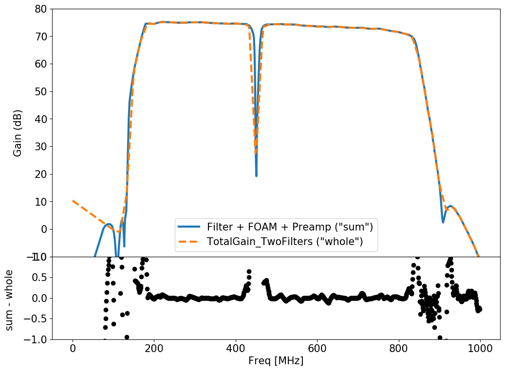

This plot compares the two different ways of applying the gain and filters in AraSim. One is to do preamp + filter + foam, the other is to do totalgain_twofilters. It seems based on this study that they are basically equivalent.

Recommend py3 (py2 probably works) with matplotlib.

Make the figure by simply running: `python compare_filter_methods.py`

